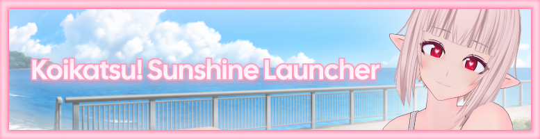
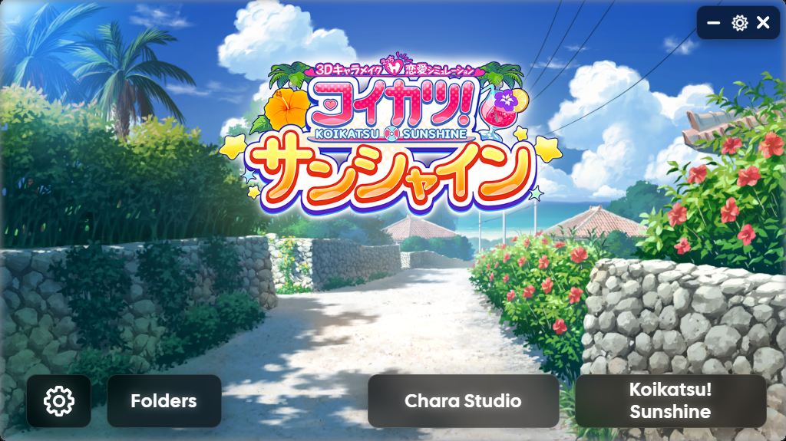
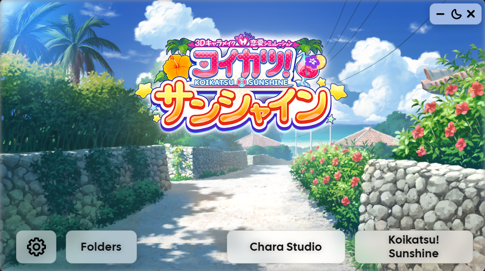

# Koikatsu Sunshine Launcher

<p align="center">
  
  
</p>

<p align="center">
  
  
  
  
</p>

---

A modern, lightweight alternative launcher built with **Rust** and **Tauri** for *Koikatsu! Sunshine*. Designed with a clean interface based on **Glassmorphism** (frosted glass effect using SVG blur filters) and a carefully crafted visual style.

The goal of this launcher is to provide a convenient alternative that centralizes the game's graphical settings, management of essential BepInEx patches before launching, and quick access to the folders you use every day — with full light and dark mode support.

## ✨ Features

### ⚙️ Game Configuration
* **Handy Resolutions:** Quick selection of resolutions in common aspect ratios ($16:9$, $16:10$), or the option to type in a custom resolution. This safely edits the game's `setup.xml` file (respecting its UTF-16 encoding).
* **Quality & Display:** Controls to choose Unity's graphics quality level and the monitor you want the game to run on.
* **Languages & Fonts:** Automatically detects the selected language and applies fallback fonts in `TextMeshPro` so that complex scripts (Asian, Cyrillic, etc.) don't break or show empty boxes.

### 🔌 BepInEx & Plugin Management (Pre-launch)
* **Debug Console:** Enable or disable the BepInEx command/log window directly.
* **Enable/Disable Plugins:** Toggle specific patches on or off before launching the game via safe file renaming of `.dll` files:
  * *RimRemover* (`KKS_RimRemover.dll`)
  * *Autosave* (`KKS_Autosave.dll`)
  * *Stiletto* (`KKS_Stiletto.dll`)

### 🎨 Interface Customization
* **Glass Effect & Parallax:** Translucent interface with Dark/Light mode toggle and an interactive background that subtly reacts to mouse movement.
* **Custom Background & Logo:** You can load your own images for the background or the main logo. The launcher internally converts them to Base64 for efficient handling.

### 📂 Quick Access
* **Frequent Folders:** Buttons to open directly in Windows Explorer the folders every content and character creator needs at hand (based on real usage experience): male and female characters, clothing coordinates, Studio scenes, mods, screenshots, and advanced settings.

---

## 📸 Screenshots

<p align="center">
  
  
</p>

---

## 🚀 Installation & Usage

Choose whichever method works best for your setup from the **Releases** section:

### Option 1: Portable Version (`Launcher-Portable-x64.zip`) — *Recommended*
1. Download the `.zip` file.
2. Extract all its contents directly into your **game's root folder** (where `KoikatsuSunshine.exe` is located).
3. After extracting, the structure inside your game should look like this:
   * `KoikatsuSunshineLauncher.exe`
   * `\UserData\fonts\` (Contains fallback font files such as `arialuni_sdf_u2019`, `thai_font`, etc., required for extra language support).
   * `\UserData\KoikatsuSunshineLauncher\` (Empty folder ready to store your `settings.json`, custom background, and logo if you decide to change them from the settings panel).

> ⚠️ **Important:** The launcher strictly validates paths before opening. If you run it outside the game's root folder, it will show a preventive warning to avoid any incorrect configuration.

### Option 2: Installer Version (`Launcher-Installer-x64.msi`)
1. Download the `.msi` automatic installer.
2. Run it and follow the standard Windows setup wizard. The installer comes with the font package bundled and extracts it automatically.
3. During the process, just make sure to **select your game's root folder** as the installation directory.

---

## 🛠️ Development & Building

If you want to clone the project and build it yourself, you'll need Rust and Node.js set up on your system.

1. Clone the official repository:
```bash
   git clone [https://github.com/deadshark3d/Koikatsu-Sunshine-Launcher.git](https://github.com/deadshark3d/Koikatsu-Sunshine-Launcher.git)
   cd Koikatsu-Sunshine-Launcher
```
---

## 📄 Credits & Technologies

### 🛠️ Technologies Used

- **Backend:** Rust + Tauri v2
- **Frontend:** HTML5, CSS3 (Custom Properties, Glassmorphism UI, and Cal Sans typography) + Vanilla JavaScript
- **Data Handling:** `serde` and `serde_xml_rs` for safe reading and writing of the game's XML configuration file

---

## 🙏 Special Thanks

This project would not have been possible without the prior work of the community. My gratitude goes to everyone who dedicated time and effort to documenting, preserving, and improving the modding ecosystem for Illusion games.

### IllusionMods / IllusionLaunchers

For their tools, documentation, and resources that have been fundamental to the preservation, maintenance, and improvement of Illusion games.

### ManlyMarco

Much of the knowledge used during the development of this launcher comes from studying their projects, launchers, and tools. Their work made it possible to better understand the game's internal structure, configuration logic, and various technical aspects of the modding environment.

Thank you for sharing so many years of knowledge with the community.

---

## 📜 License

This project is distributed under the license specified in this repository. Names, trademarks, and resources related to *Koikatsu! Sunshine* belong to their respective owners.

This launcher is a community-developed project and is not officially affiliated with Illusion or any of the tools mentioned above.
